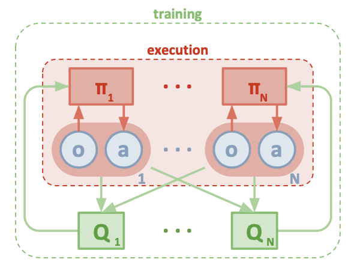
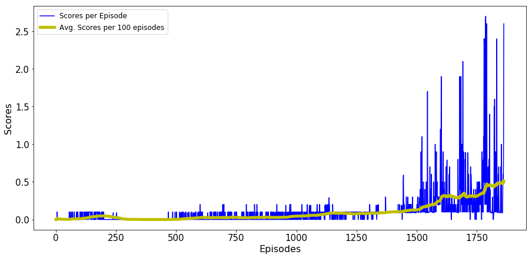

# Project Report - Collaboration and Competition

**Introduction**

This project solves a tennis environment simulated in Unity. In this environment, two agents control rackets to bounce a ball over a net. If an agent hits the ball over the net, it receives a reward of +0.1. If an agent lets a ball hit the ground or hits the ball out of bounds, it receives a reward of -0.01. Thus, the goal of each agent is to keep the ball in play. 

The observation space consists of 8 variables corresponding to the position and velocity of the ball and racket. Each agent receives its own, local observation. Two continuous actions are available, corresponding to movement toward (or away from) the net, and jumping. The task is episodic, and to solve the environment, the agents must get an average score of +0.5 (over 100 consecutive episodes, after taking the maximum over both agents).

**Learning Algorithm**

Multi-Agent Deep Deterministic Policy Gradients (MADDPG), a reinforcement learning model is used in this project. Each agent is modeled as a Deep Deterministic Policy Gradient (DDPG) agent with some information shared between the agents. 

In particular, each of the agents in this model has an actor and a critic model respectively. The actors of each agents receive observations from the environment states as input for their respective agents. Their output is a (two-dimensional) action. The critics of each actor, on the other hand, receives the information from both actors of the agents. The imbalanced information allows the MADDPG to adopt a framework of a centralised training and decentralised execution.

Both agents use a common replay buffer to pool past experiences and draw samples from to break consecutive state action correlation.

**Model Architecture**

The chose model architecture does not differ from the [original paper](https://arxiv.org/pdf/1706.02275.pdf) - two fully connected layers with ReLu activation functions. Weights for local and target critics are set at the same value initially. 

Noise was initially introduced and kept constant until 30000 time steps, i.e. noise is removed after around 1000 episodes. 

The Model structure of the multi-agent decentralise actor, centralised critic approach can be summarised in the diagram below:

**Chosen hyper parameters**

Replay buffer size: int(1e4)  
Batch_size: 256                  
Soft update parameter Tau: 1e-3
Update frequency: 2
Learning rate for the actor: 1e-4  
Learning rate for the critic: 1e-3
Weight decay rate: 0

**Results**

The MADDPG model solved the problem in 1862 episodes, and scored an average of 0.511 in 100 episodes. Following figure shows the average score plot.

**Plot of Rewards**

**Ideas for Future Work** 

Other algorithms may potentially be helpful for this low dimension environment could be PPO. It could also be interesting to further fine tune parameters such as replay buffer and noise decay.